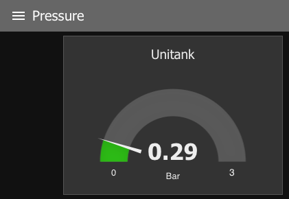
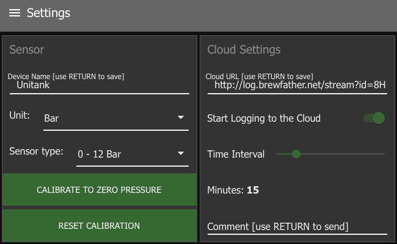

Node RED Pressure Monitor
===============

### About

Node RED Pressure Monitor is a Node-RED flow for monitoring pressure during fermentation.

It reads pressure from an analog 5 VDC pressure sensor via a ADC121C021 analog-to-digital coverter chip from Texas Instruments. It communicates with the ADC via the I2C bus of the Raspberry Pi.
The pressure is avilable on the local dashboard gauge in Node RED. It can also be configured to send the data to the [Brewfather](https://brewfather.app/) brewing software.

### Dependencies
* node-red-dashboard
* node-red-node-smooth
* i2c-bus
* node-red-contrib-i2c

### Detailed description
Full details about how to build the pressure sensor and installing the monitor flow, please refer to [this page](https://www.norgesvej12a.dk/husbryg/first-brew-with-live-pressure-monitor/).

### License
This project is licensed under the MIT License - see the [LICENSE](LICENSE) file for details.